## WELCOME! 👋

My name is 😁`Nikita Kryukov`, I am from 🗺️`St. Petersburg`, and I am an enthusiast-developer focusing on `NodeJS` with 🖥️`TypeScript`.
I have more than 6 years of clear commercial experience which 3 of them is crypto projects development.

### SKILLS & TOOLS

#### Code

#### Stack

### MY STATS

